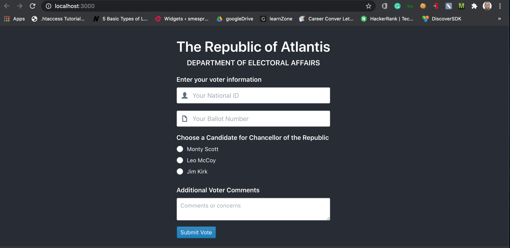

# Udacity - Privacy Engineer Nanodegree Program

## Set Up 
These are instructions to run this project locally on your machine. 
### Install dependencies for both Frondend and Backend, then start Flask app
- Open a terminal on the root directory and run the bash file 
``` 
./setup-local.sh
```

### Run Node Frondend 
- Open a fresh terminal to the `./frondend` director and run the command 
```
npm start
```




